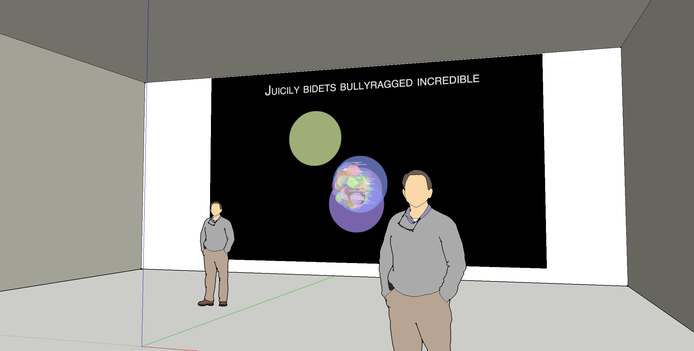
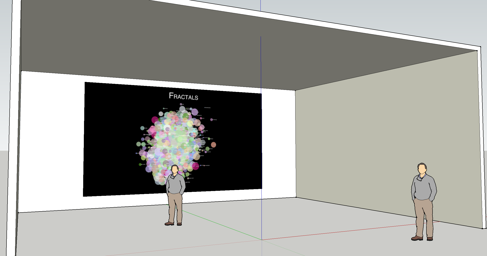

The exhibition display will be a projection of the project running in a browser.  Because the project is changing constantly and unpredictably there should be seating of some kind, preferably bean bags or lounging chairs that allow visitors to live with and become absorbed in the work.    

